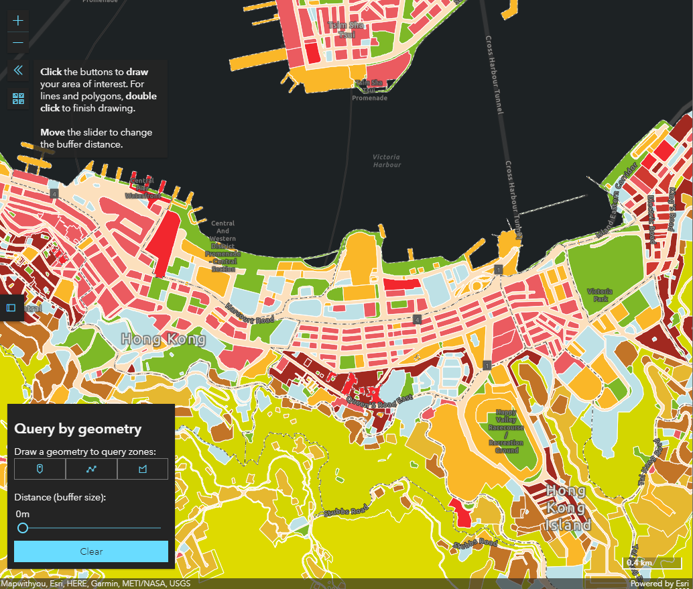

# Zone In: Query zonings within neighbourhood

<p style='font-size:20px;align:center;'>
  <a href='https://khwong12.github.io/OZP_buffer_stat/'>CHECK THE WEB APPLICATION</a>
</p>



**Zone In** is a web map application for users to interactively explore the land use zonings in Hong Kong and investigate the distribution of zonings in the proximity in any areas.

**Zone in** is useful to you when:

- You would like to do a quick exploratory analysis about the land use composition of a specific project site
- You want to check the percentage of land zoned as residential within certain distance (say, 400 m) away from a building
- You want to check the gazette date of a specific piece of zoning
- ... and more

## Feature Highlights

- Draw **any** geometries for any area of interested/study areas
- Instantly compute the total area and percentage of total of various land uses within given distance
- Immediate summary data visualidation

## Overview

## Example Usage

## How to Use

### Check zonings within specific area

1. Go to any area you would like to investigate
1. Draw a geometry
1. Select the desired buffer distance
1. The application will then compute the area of each selected zoning type and visualise the proportions as charts

### Query zonings

1. Clicking on any zoning piece
1. A pop-up will show on the map, including details of that zone like full zoning name, respective plan number and gazette date

## Issues

## Licensing

TODO

## TODO

- Features: Add historical OZP to show temporal changes
- UI: allow users to control transparency of OZP layer
- UI: use "reverse-clip" to disable/decrease opacity of the zones outside query geometry
- performance: drop async/await

## Caveats

Only zonings **on land** are shown and included in the calculation of OZP area. Zonings on water like following are excluded:

- *Marine Basin* (in H24)
- *Typhoon Shelter* (in H15, K20, I-CC, etc.)
- *Vessel Anchorage / Sea Channel* (in I-SKC)
- *River Channel* (in ST, I-TOTC, etc.)
- *Nullah* (in K15, etc.)
- *Inlet* (in I-NEL)

---

## Usage for Developers

To locally build and preview this website, follow the steps below.

1. Clone this project
    ```sh
    git clone https://github.com/KHwong12/OZP_buffer_stat.git
    ```
2. Make sure **npm** and **node.js** are installed in your machine
3. At project root folder, install the npm dependencies
    ```sh
    npm install
    ```
4. Run this project on local server
   ```sh
   npm run dev-server
   ```
